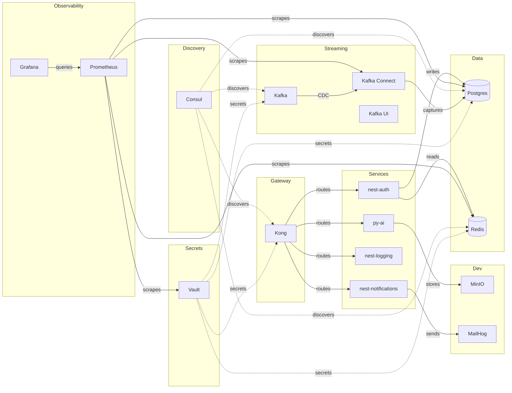

# sca-templates

> A multi-platform ecosystem spanning client, server, architecture and self-hosted infrastructure. Vault-sealed secrets, loopback-only networking, and one repo per concern.

---

## What is this?

A batteries-included platform for building and running production-ready services:

- **Infrastructure** (`infra-*` repos) — Docker Compose stacks for Vault, Postgres, Redis, Kafka, Consul, Prometheus, Grafana and Kong, all wired together on a shared `kafka-network` and bound to loopback only.
- **Microservices** (`nest-*` repos) — Domain services built with NestJS/TypeScript and wired into the infrastructure.
- **Shared packages** (`@sca/*`) — Zero-logic plumbing libraries (core, contracts, connections, clients) consumed by every microservice.
- **Documentation** (`sca-docs`) — The Obsidian knowledge base that maps the entire ecosystem; topology lives here, depth lives in each repo.
- **Dev tools** (`local-dev-tools`) — MinIO (S3) and MailHog (SMTP) for local use.

Every service follows the same pattern: own folder, own `Makefile`, own `compose.yml`, secrets from Vault via AppRole, `.env` generated at runtime, loopback-only ports, Consul health checks, and Prometheus scrape targets.

---

## Naming conventions

| Category | Convention | Examples |
| --- | --- | --- |
| Infrastructure | `infra-*` | `infra-vault`, `infra-prometheus` |
| Microservices | `nest-*` | `nest-auth`, `nest-notifications` |
| Skeleton | `nest-template` | Clone this to create a new `nest-*` service |
| Shared packages | `@sca/*` | `@sca/core`, `@sca/contracts` |
| Documentation | `sca-docs` | — |
| Dev tools | `local-dev-tools` | — |
| Org config | `.github` | — |

Framework-first naming: the framework implies the platform (`nest-*` = backend API, `react-*` = frontend web, `next-*` = fullstack web, `react-native-*` = mobile).

---

## Repository map

### Infrastructure

| Repo | Description | Tags |
| --- | --- | --- |
| [infra-vault](https://github.com/sca-templates/infra-vault) | Secrets management with transit encryption, AppRole auth and Raft consensus | vault, hashicorp, secrets, raft, approle |
| [infra-postgres-app](https://github.com/sca-templates/infra-postgres-app) | Relational database with vector extensions, admin UI and CDC source | postgres, pgvector, pgadmin, cdc, database |
| [infra-redis](https://github.com/sca-templates/infra-redis) | In-memory data store with persistence and password authentication | redis, cache, persistence, database |
| [infra-kafka](https://github.com/sca-templates/infra-kafka) | Event streaming platform with KRaft, connectors and schema registry | kafka, kraft, streaming, cdc, event-driven |
| [infra-consul](https://github.com/sca-templates/infra-consul) | Service discovery with health checks and gossip-based clustering | consul, service-discovery, health-checks, networking |
| [infra-prometheus](https://github.com/sca-templates/infra-prometheus) | Metrics collection, alerting rules and PromQL querying | prometheus, metrics, alerting, tsdb |
| [infra-grafana](https://github.com/sca-templates/infra-grafana) | Dashboard visualization, provisioned data sources and alerting | grafana, dashboards, visualization, monitoring |
| [local-dev-tools](https://github.com/sca-templates/local-dev-tools) | Local development tools — S3-compatible storage and SMTP capture | dev-tools, minio, mailhog, local-development |

### Microservices

| Repo | Description | Tags |
| --- | --- | --- |
| [nest-template](https://github.com/sca-templates/nest-template) | NestJS service skeleton with gRPC, Kafka and Vault integration | nestjs, template, skeleton, typescript |
| [nest-auth](https://github.com/sca-templates/nest-auth) | Authentication, authorization and access control service | auth, authentication, authorization, rbac |
| [nest-notifications](https://github.com/sca-templates/nest-notifications) | Multi-channel notification delivery — push, email and SMS | notifications, push, email, sms |
| [nest-logging](https://github.com/sca-templates/nest-logging) | Audit trail and structured logging service | logging, audit, structured-logging |
| [py-ai](https://github.com/sca-templates/py-ai) | AI/ML integration service with vector storage | ai, ml, integrations, vector |

### Shared packages

| Package | Description | Tags |
| --- | --- | --- |
| [@sca/core](https://github.com/sca-templates/sca-core) | Utilities, decorators and error handling | core, utilities, decorators, error-handling |
| [@sca/contracts](https://github.com/sca-templates/sca-contracts) | gRPC and Kafka event definitions | contracts, grpc, kafka-events, schemas |
| [@sca/connections](https://github.com/sca-templates/sca-connections) | Database, cache and message broker connections | connections, database, cache, broker |
| [@sca/clients](https://github.com/sca-templates/sca-clients) | Service-to-service client wrappers | clients, service-to-service, wrappers |

### Documentation

| Repo | Description | Tags |
| --- | --- | --- |
| [sca-docs](https://github.com/sca-templates/sca-docs) | Obsidian knowledge base — topology, contracts, ADRs and glossary | docs, obsidian, knowledge-base, architecture |

---

## Architecture



---

## Quick start

```bash
git clone https://github.com/sca-templates/infra-vault.git
cd infra-vault && make dev

git clone https://github.com/sca-templates/infra-postgres-app.git
cd infra-postgres-app && make all

git clone https://github.com/sca-templates/infra-redis.git
cd infra-redis && make all

git clone https://github.com/sca-templates/infra-kafka.git
cd infra-kafka && make all

git clone https://github.com/sca-templates/infra-consul.git
cd infra-consul && make all
```

---

## Conventions

| Rule | Detail |
| --- | --- |
| **One fact, one place** | Topology in `sca-docs`, depth in each repo, READMEs point — never duplicate |
| **English always** | Code, commits, PRs, docs |
| **Loopback only** | Every port binds to `127.0.0.1`; nothing exposed on LAN |
| **Vault-seeded** | `.env` generated by `make env` from Vault; never commit `.env` or secrets |
| **Idempotent makes** | `make all` can be run repeatedly without side effects |
| **Consul-registered** | Every service is in `consul/scripts/services.txt` with a TCP health check |
| **Prometheus-scraped** | Exporters feed the central TSDB; dashboards render in Grafana |
| **Docs-as-code** | Every change lands through a PR with review |

---

## Contributing

1. Fork and branch off `main`.
2. Follow the conventions above (Makefile targets, Vault secrets, loopback).
3. Run `make validate` in your service.
4. Open a PR and fill the checklist.

See [CONTRIBUTING.md](https://github.com/sca-templates/sca-docs/blob/main/CONTRIBUTING.md) for the full definition of done.

---

## License

MIT © [sca-templates](https://github.com/sca-templates)
